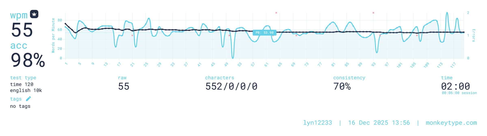

I'm LTQ, currently an undergraduate in the department of electronics and information in NWPU.  

> WTF am i learning?

## my repositories

- primary works:
  - [cmem](https://github.com/lyn12233/cmem): c infrastructures. trying to use c in a c++ style.
  - [cum20240901](https://github.com/lyn12233/cum20240901): 2024-CUMCM solution to problem B (CUMCM: china undergraduate math contest for modeling)
  - [typst_utils](https://gitee.com/ltq12233/typst_utils): a typst style setting aligning to graduatoin paper format
- further projects:
  - [EmbeddedSSH](https://github.com/lyn12233/EmbeddedSSH): SFTP server on stm32f103ze development board. also a great *code template for embedded system* based upon arm compiler-v6 (while most templates only support v5). (also a [stub generator](https://github.com/lyn12233/uvhelper) that parses uvision project file to make code recognized by clangd)
  - [hmk_opengl](https://github.com/lyn12233/hmk_opengl): c++ program showcasing ubiquitous and advanced computer graphics tech(from color model, camera model to shadow mapping, defer rendering, parallax mapping, ray marching), as well as gui framework(font rendering, box sizer, button, editable text, event propagation)
- notes:
  - [notetaking](https://github.com/lyn12233/notetaking)

more forks an repos can be found at repos under [my gitee account](https://gitee.com/ltq12233)

## target and orientation

> WTF

## contact me

- ID(in university): 2023302053
- email: waaaaard@qq.com

## daily records

  
  
 i like typing 

